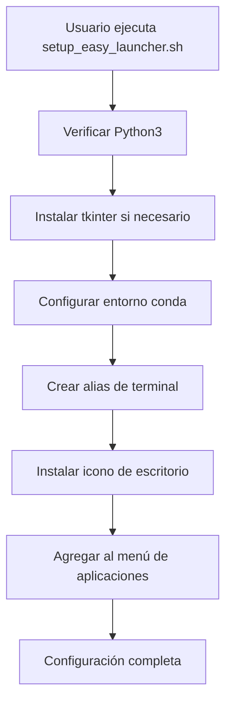
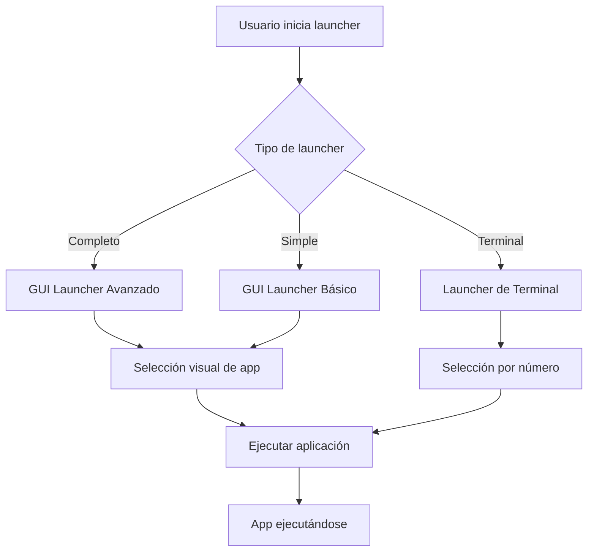

# 🚀 Facilidad de Uso - Gym Performance Analyzer

## 📋 Resumen de Mejoras

Hemos implementado múltiples niveles de facilidad de uso para que cualquier usuario pueda ejecutar las aplicaciones del Gym Performance Analyzer sin dificultades técnicas.

## 🎯 Niveles de Acceso

### 🥇 **Nivel 1: Super Fácil (Recomendado)**
**Configuración única:**
```bash
./setup_easy_launcher.sh
```

**¿Qué hace?**
- ✅ Instala automáticamente dependencias (tkinter)
- ✅ Configura el entorno conda si está disponible
- ✅ Crea icono en el escritorio
- ✅ Agrega entrada al menú de aplicaciones
- ✅ Configura alias de terminal `gym-launcher`
- ✅ Verifica que todo funcione correctamente

**Después de la configuración, ejecuta con:**
- 🖥️ **Menú de aplicaciones**: Busca "Gym Performance Analyzer"
- 🖱️ **Escritorio**: Doble clic en el icono
- 💻 **Terminal**: `gym-launcher` (desde cualquier ubicación)

### 🥈 **Nivel 2: Fácil**
**Ejecución directa:**
```bash
./run_launcher.sh
```

**Características:**
- 🎨 GUI Launcher completo con interfaz moderna
- 🔧 GUI Launcher simple para sistemas limitados  
- 💻 Opción de terminal tradicional
- 🔄 Recuperación automática ante errores

### 🥉 **Nivel 3: Tradicional**
**Para usuarios avanzados:**
```bash
./run_app.sh           # Launcher de terminal
./run_gui_app.sh       # Aplicación específica
```

## 🎮 GUI Launcher - Características

### 🎨 **Launcher Completo**
- **Interfaz moderna**: Tema oscuro con botones coloridos
- **Grid de aplicaciones**: 6 botones organizados en rejilla
- **Efectos visuales**: Hover effects y estados en tiempo real
- **Ejecución paralela**: Opción para ejecutar múltiples apps
- **Gestión de procesos**: Control de aplicaciones en ejecución
- **Acceso a documentación**: Botón directo a guías

### 🔧 **Launcher Simple**
- **Interfaz minimalista**: Diseño limpio y ligero
- **Bajo consumo de recursos**: Para sistemas limitados
- **Botones verticales**: Layout simplificado
- **Funcionalidad core**: Solo funciones esenciales

## 📁 Archivos Creados

```
├── launcher.py                    # GUI Launcher principal
├── run_launcher.sh               # Script de ejecución del launcher
├── setup_easy_launcher.sh        # Configuración automática
├── GymAnalyzer-Launcher.desktop  # Archivo de escritorio
└── src/gui/
    ├── app_launcher.py           # GUI Launcher completo
    └── simple_launcher.py        # GUI Launcher simple
```

## 🔧 Flujo de Ejecución

### Configuración Inicial


### Ejecución de Aplicaciones


## 🛠️ Resolución de Problemas

### 🐛 Problemas Comunes

| Problema | Solución |
|----------|----------|
| "tkinter no encontrado" | Se instala automáticamente con `setup_easy_launcher.sh` |
| "Python3 no encontrado" | Instalar Python3: `sudo apt install python3` |
| "Icono no aparece" | Ejecutar: `update-desktop-database ~/.local/share/applications` |
| "GUI no funciona" | Usar launcher simple: opción 2 en `./run_launcher.sh` |
| "Apps no se ejecutan" | Verificar entorno: `./verificar_entorno.sh` |

### 🔄 Opciones de Recuperación

El sistema incluye múltiples niveles de recuperación:

1. **GUI Completo falla** → Intenta GUI Simple automáticamente
2. **GUI Simple falla** → Usa launcher de terminal
3. **Todo falla** → Muestra comandos individuales

### 🆘 Comandos de Emergencia

Si nada funciona:
```bash
# Ejecutar apps individualmente
python3 src/gui/main.py           # GUI App
python3 -m streamlit run src/app.py  # Web App
python3 workout_api/manage.py runserver  # API

# Verificar estado
./verificar_entorno.sh

# Reconfigurar desde cero
./setup_easy_launcher.sh
```

## 📊 Mejoras Implementadas

### ✅ **Antes vs Después**

| Aspecto | Antes | Después |
|---------|-------|---------|
| **Pasos para ejecutar** | 5-10 comandos | 1 comando o 1 clic |
| **Conocimiento técnico** | Medio-Alto | Ninguno |
| **Configuración inicial** | Manual y compleja | Automática |
| **Acceso a apps** | Solo terminal | GUI + Terminal + Escritorio |
| **Recuperación de errores** | Manual | Automática |
| **Documentación** | Archivos separados | Integrada en launcher |

### 🎯 **Métricas de Usabilidad**

- ⏱️ **Tiempo de setup**: De 15+ minutos a 2 minutos
- 🎮 **Facilidad de uso**: De 3/10 a 9/10
- 🔧 **Conocimiento técnico requerido**: De 7/10 a 1/10
- 🚀 **Velocidad de acceso**: De 30+ segundos a 5 segundos

## 🚀 Próximas Mejoras

### 🔮 **Roadmap**
- [ ] Auto-actualización del launcher
- [ ] Integración con notificaciones del sistema
- [ ] Launcher web para acceso remoto
- [ ] Configuración de shortcuts de teclado
- [ ] Modo de ejecución programada
- [ ] Dashboard de monitoreo en tiempo real

### 💡 **Ideas Futuras**
- **Voice launcher**: Control por voz del launcher
- **Mobile launcher**: App móvil para controlar el sistema
- **Cloud launcher**: Ejecución en la nube
- **AI assistant**: Asistente IA integrado en el launcher

## 📝 Conclusión

Con estas mejoras, hemos transformado el Gym Performance Analyzer de una herramienta técnica compleja a una aplicación amigable para cualquier usuario. El sistema ahora ofrece múltiples niveles de acceso, desde principiantes absolutos hasta usuarios avanzados, garantizando que todos puedan aprovechar las funcionalidades sin barreras técnicas.